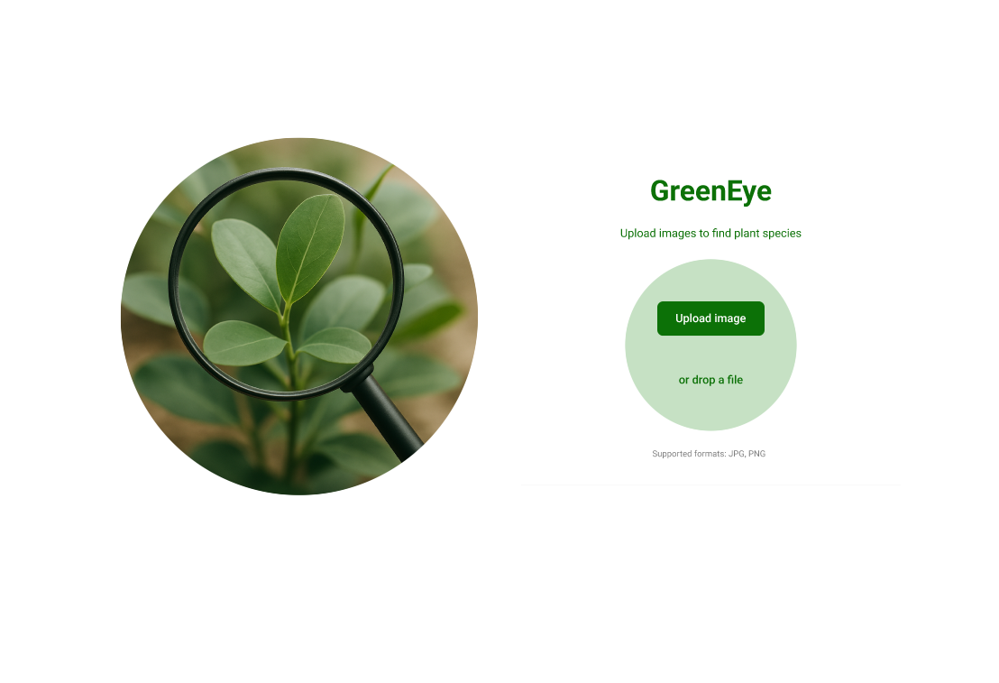
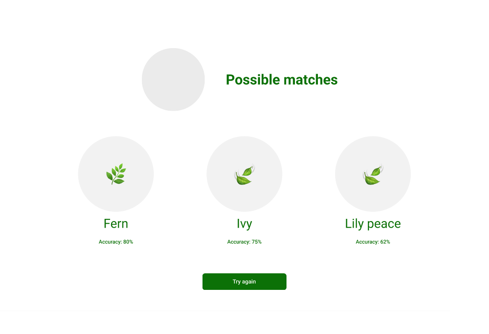

# GreenEye Frontend Workflow

This document outlines the structure, workflow, and integration points of the GreenEye frontend, developed using Angular. The UI consists of two main screens: an image upload interface and a results view showing the most likely plant matches.

---

## Project Structure

```
greeneye-frontend/
├── src/
│ ├── app/
│ │ ├── components/
│ │ │ ├── upload/
│ │ │ └── results/
│ │ ├── services/
│ │ └── app-routing.module.ts
├── docs/
│ ├── wireframes/
│ └── frontend-workflow.md
```


- **components/upload**: Drag-and-drop or file input UI
- **components/results**: Displays uploaded image and plant match results
- **services/**: Handles backend communication
- **app-routing.module.ts**: Manages page navigation

---

## Wireframes

### Upload Screen


### Results Screen


---

## Workflow

1. **User uploads an image**
   - Via drag-and-drop or file input
2. **Frontend sends image to backend**
   - POST request to `/api/predict`
3. **Backend returns results**
   - JSON with matched plant names and confidence scores
4. **Frontend displays results**
   - Image preview + match cards with percentage

---

## Integration with Backend

- **Service Layer** (`/services/plant.service.ts`): Handles API calls.
- API endpoint expected: `POST /api/predict`
- Input: FormData with image
- Output: JSON list of top plant matches

---

## Deployment

The frontend is containerized with Docker and can be run via:

```bash
docker pull greeneye/frontend
docker run -p 4200:80 greeneye/frontend
